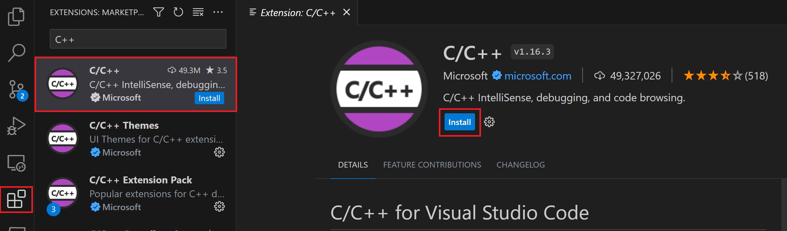

# C/C++ Dasturlash Muhitini Sozlash

## O'rnatish Bosqichlari

### 1. VS Code C/C++ Kengaytmasi

VS Code uchun C/C++ kengaytmasini o'rnating. C/C++ kengaytmasini Extensions (Ctrl+Shift+X) bo'limida 'C++' deb qidirib o'rnatishingiz mumkin.



### 2. MSYS2 O'rnatish

1. MSYS2 dasturini o'rnating. https://github.com/msys2/msys2-installer/releases/download/2024-01-13/msys2-x86_64-20240113.exe orqali yuklab oling va o'rnating.
2. .exe file ni ishga tushiring va o'rnatish bosqichlarini bajaring (hammasini next qilsayz bo'ladi).
3. Ornatoyatganingizda o'zingiz xohlagan o'rnatish papkasini tanlang. Bu manzilni keyinroq ishlatish uchun eslab qoling.
   > Ko'p hollarda, tavsiya etilgan papka manzili to'g'ri keladi.
4. O'rnatish tugagandan so'ng, **Run MSYS2 now** katakchasini belgilangan holda qoldiring va **Finish** tugmasini bosing. Bu sizga MSYS2 terminal oynasini ochib beradi.

### 3. MinGW-w64 Toolchain O'rnatish

1. Ushbu terminalda, quyidagi buyruqni ishga tushirish orqali MinGW-w64 toolchain dasturini o'rnating:
   ```bash
   pacman -S --needed base-devel mingw-w64-ucrt-x86_64-toolchain