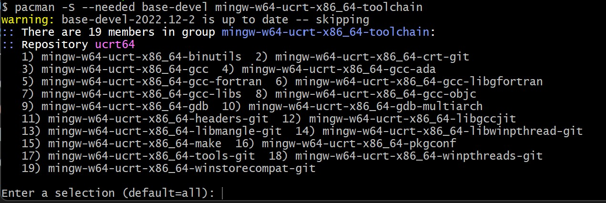

# C/C++ Development Environment Setup Guide

## 1. VS Code uchun C/C++ Kengaytmasi

1. VS Code da C/C++ kengaytmasini o'rnating
2. Extensions panelini oching (`Ctrl+Shift+X`)
3. Qidiruv maydoniga 'C++' deb yozing
4. Kengaytmani o'rnating


## 2. MSYS2 ni O'rnatish

### O'rnatish Jarayoni

1. https://github.com/msys2/msys2-installer/releases/download/2024-01-13/msys2-x86_64-20240113.exe orqali yuklab oling
2. .exe faylni ishga tushiring
3. O'rnatish bosqichlarini bajaring:
   - O'rnatish papkasini tanlang (manzilni eslab qoling)
   - Standart sozlamalar uchun "Next" tugmasini bosing
4. O'rnatish yakunida:
   - "Run MSYS2 now" katakchasini belgilangan holda qoldiring
   - "Finish" tugmasini bosing

### MinGW-w64 Toolchain ni O'rnatish

1. Ochilgan MSYS2 terminalida quyidagi buyruqni kiriting:
```bash
pacman -S --needed base-devel mingw-w64-ucrt-x86_64-toolchain
```
2. So'ralgan savolga "Enter" tugmasini bosing
3. Tasdiqlash uchun "y" harfini kiritib, "Enter" ni bosing



## 3. PATH Muhit O'zgaruvchisini Sozlash

1. Windows qidiruv panelida "Settings" ni oching
2. "Edit environment variables for your account" ni qidiring
3. PATH o'zgaruvchisini sozlash:
   - "User variables" bo'limida "Path" ni tanlang
   - "Edit" tugmasini bosing
   - "New" tugmasini bosing
   - MinGW-w64 papka manzilini qo'shing:
     - Standart manzil: `C:\msys64\ucrt64\bin`
   - "OK" tugmasini bosing

### Muhim Eslatma

⚠️ Yangi PATH muhit o'zgaruvchisi ishga tushishi uchun barcha terminal oynalarini qayta ochishingiz kerak.
